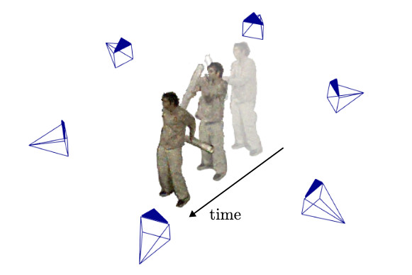

# [Dynamic EventNeRF: Reconstructing General Dynamic Scenes from Multi-view RGB and Event Streams](https://4dqv.mpi-inf.mpg.de/DynEventNeRF/)
[Viktor Rudnev](https://vrudnev.me/), [Gereon Fox](https://people.mpi-inf.mpg.de/~gfox/), [Mohamed Elgharib](https://people.mpi-inf.mpg.de/~elgharib/), [Christian Theobalt](https://www.mpi-inf.mpg.de/~theobalt/), [Vladislav Golyanik](https://people.mpi-inf.mpg.de/~golyanik/)



Based on [EventNeRF codebase](https://github.com/r00tman/EventNeRF), which is based on [NeRF-OSR codebase](https://github.com/r00tman/NeRF-OSR), which is based on [NeRF++ codebase](https://github.com/Kai-46/nerfplusplus) and inherits the same training data preprocessing and format.

## Data

Download the processed datasets from [here](https://edmond.mpg.de/dataset.xhtml?persistentId=doi:10.17617/3.AD2LQB).

Untar the downloaded archives (`processed_synth.tar.xz`, `processed_real.tar.xz`) directly into `data/` sub-folder in the code directory.

To process one of our raw aedat4 into the format directly supported by our code, please follow instructions in [`processing/README.md`](https://github.com/r00tman/DynEventNeRF/blob/main/preproc/README.md).

See NeRF++ sections on [data](https://github.com/Kai-46/nerfplusplus#data) and [COLMAP](https://github.com/Kai-46/nerfplusplus#generate-camera-parameters-intrinsics-and-poses-with-colmap-sfm) on how to create adapt a new dataset for training. 

Please contact us if you need to adapt your own event stream as it might need updates to the code.

## Create environment

```bash
conda env create --file environment.yml
conda activate dyneventnerf
cd edi_cpp
python setup.py develop
```

## Training and Testing

Please replace `<absolute-path-to-code>` and `<path-to-conda-env>` in the `.sh` scripts and the corresponding `.txt` config file
To do so automatically for all of the files, you can use `sed`:
```bash
sed 's/<absolute-path-to-code>/\/your\/path/' configs/**/*.txt scripts/*.sh
sed 's/<path-to-conda-env>/\/your\/path/' scripts/*.sh
```

Use `ddp_train_nerf.py` for training and `ddp_test_nerf_video.py` for rendering.
Note that we provide batch submission scripts from `sched/` subfolder for reproducing experiments from the paper.

## Training
To train a synthetic scene:
```bash
export common="--train_split train_rounded --N_iters 150001 --N_anneal_lambda 30000 --use_lr_scheduler False --event_threshold 0.5 --tstart 0 --tend 1000 --neg_ratio 0.9 --tonemap_eps 1e-2 --use_viewdirs False --damping_strength 1.0"
export base="--config configs/mlp2_lambda1e-3.txt --lrate 1e-4 --max_freq_log2_pos 14 --max_freq_log2_time 7"
export fullmodel=${base}" --lambda_reg 1e-2"

export scene=lego_dyn2
export sceneargs=""

python ./ddp_train_nerf.py --expname fullablations_full_${scene} --scene data/dynsyn/${scene} $common $sceneargs $fullmodel
```

This will train `lego_dyn2` scene using full DynEventNeRF model.

For `blender` scene, use correct background color and cylinder clipping radius:
```bash
export sceneargs="--bg_color 70 --crop_r 0.2"
```

For `dress` scene, use correct cylinder clipping radius:
```bash
export sceneargs="--crop_r 0.4"
```

To train a real scene:
```bash
export common="--N_iters 150001 --N_anneal_lambda 30000 --use_lr_scheduler False --event_threshold 0.5 --neg_ratio 0.9 --tonemap_eps 3e-2 --use_viewdirs False"
export base="--config configs/mlp2_lambda1e-3.txt --lrate 1e-4 --max_freq_log2_pos 14 --max_freq_log2_time 7"
export normal="--lambda_reg 1e-2 --damping_strength 0.93"

export scene="24-04-30_80_90_5fps_ls0.5_3e-2"
export sceneargs="--tstart 190 --tend 310"

python ./ddp_train_nerf.py --expname cvprfullrealcomp_full_$scene --scene data/dynsyn/$scene $common $sceneargs $base $normal
```

This will train full model for scene `24-04-30_80_90_5fps_ls0.5_3e-2`, starting at `t=190` and ending at `t=310`. Full scene is 0 to 1000.

You can also prepend `./scripts/launcher_multi_archive.sh` to the commands for automatic archival of code and splitting up training in smaller SLURM jobs.
Please also take a look at different example batch training scripts at `sched/`.

## Rendering

To render test views:
```bash
export x="<trained experiment name>"
python ./ddp_test_nerf_video.py --render_split test_5view --write_video True --render_bullet_time False --testskip 1 --config logs_auto/$x/args.txt
```

To render bullet-time views (rotating slow motion camera):
```bash
export x="<trained experiment name>"
# if --tstart was 0
python ./ddp_test_nerf_video.py --render_split circle_start --write_video True --render_bullet_time True --testskip 10 --config logs_auto/$x/args.txt
# if --tend was 1000
python ./ddp_test_nerf_video.py --render_split circle_end --write_video True --render_bullet_time True --testskip 10 --config logs_auto/$x/args.txt
# otherwise
python ./ddp_test_nerf_video.py --render_split circle_middle --write_video True --render_bullet_time True --testskip 10 --config logs_auto/$x/args.txt
```

Splits `circle_start`, `circle_middle`, `circle_end` are designed to be seamlessly combined for multi-segment reconstructions, where each model only represents a part of the training data, but their combination spans across the whole sequence.
Those renderings can be combined using `tools/blend_frames1.py` or `tools/blend_frames1_auto.py`.

## Evaluation
Please find the guide on evaluation, color-correction, and computing the metrics in [`metric/README.md`](https://github.com/r00tman/DynEventNeRF/blob/main/metric/README.md).
This folder and corresponding files will be uploaded soon.

## Citation

Please cite our work if you use the code.

```
@article{rudnev2025dynamiceventnerf,
  title={Dynamic EventNeRF: Reconstructing General Dynamic Scenes from Multi-view RGB and Event Streams},
  author={Rudnev, Viktor and Fox, Gereon and Elgharib, Mohamed and Theobalt, Christian and Golyanik, Vladislav},
  journal={CVPR Workshop on Event-based Vision},
  year={2025}
}
```

## License

This work is licensed under the Creative Commons Attribution-NonCommercial-ShareAlike 4.0 International License. To view a copy of this license, visit [http://creativecommons.org/licenses/by-nc-sa/4.0/](http://creativecommons.org/licenses/by-nc-sa/4.0/) or send a letter to Creative Commons, PO Box 1866, Mountain View, CA 94042, USA.

